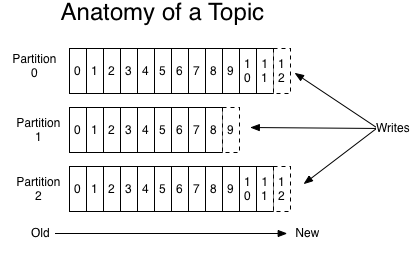

### 简介

Apache Kafka是一个分布式流处理平台，准确的讲它到底是什么？

一个流处理平台有三个关键功能：

- 发布和订阅消息流，类似于消息队列或企业消息传递系统。
- 高容错率的持久化消息流
- 处理发生的消息流

Kafka通常用于两大类应用：

- 构建可在系统或应用程序之间可靠获取数据的实时流数据管道
- 构建转换或响应数据流的实时流应用程序

要了解Kafka如何做这些事情，让我们深入探讨Kafka的能力。

首先是几个概念：

- Kafka作为一个集群运行在一个或多个可跨多个数据中心的服务器上。
- Kafka集群以`topic`类别存储`records`
- 每一个`record`包含一个`key`,一个`value`,一个`timestamp`

Kafka有四个核心的APIs:

- `Producer API`允许一个应用发布记录流到一个或多个Kafka `topics`
- `Consumer API`允许一个应用订阅多个`topics`(主题),并处理这些记录
- `Streams API`允许应用程序充当流处理器，消费来自一个或多个`topics`的消息，并输出到一个或多个`topics`
- `Connector API`允许建立一个将 Kafka `topics`连接到系统或者数据平台的可重用`producer`或`consumer`，。例如，一个关系型数据库的连接器可以捕捉到每个表的变化

Client和Server之间的交流通过一条简单、高性能并且不局限某种开发语言的TCP协议。

### Topics and Logs
`topic`：Kafka将消息种子(Feed)分门别类， 每一类的消息称之为话题(Topic).
`topic`可以有0个，1个或多个`consumer`，对于每一个`topic`,`Kafka cluster`维护一个分区log，就想下面的图：

每一个分区都是一个顺序的，不可变的消息队列，并且可以持续的添加。分区内的消息都会被分配一个序列号，称之为偏移量(offset),在每个分区中此偏移量都是唯一的。

Kafka集群可以保持所有的消息，直到它们过期，无论消息是否被消费。
实际上消费者所持有的仅有的元数据就是这个偏移量，也就是消费者在这个log中的位置。这个偏移量由消费者控制：正常情况消费者消费消息的时候，偏移量会线性的增加。但实际上偏移量由消费者控制，消费者可以重置偏移量到一个更老的位置或者跳到更前的位置，重新读取消息。
可以看到这种设计对消费者来说操作自如，一个消费者操作不会影响到其他消费者对此log的处理。

分区在log服务中的用途。首先，它允许日志扩展到超出适合单个服务器的大小，每个单独的分区必须在同一个服务器上，但是一个topic可以有多个分区，所有一个topic可以操作任意数量的数据；其次，更重要的是分区可以提供并行化的处理。

### 分布式(Distribution)
log的分区被分布到集群的多个服务器上，每个服务器处理它分到的分区。根据配置每个分区还可以复制到其它服务器作为备份容错。

每个分区有一个`leader`,0个或者多个`follower`, leader处理该分区的所有读和写，`followers`被动的复制leader。如果leader宕机，followers中的一个将自动变成新的leader。

一台服务器可能同时是一个分区的leader，另一个分区的follower。 这样可以平衡负载，避免所有的请求都只让一台或者某几台服务器处理。

###生产者(Producers)

### 问题
- 同一个topic的不同分区可以在不同的服务器上吗？
- ss
- ss  